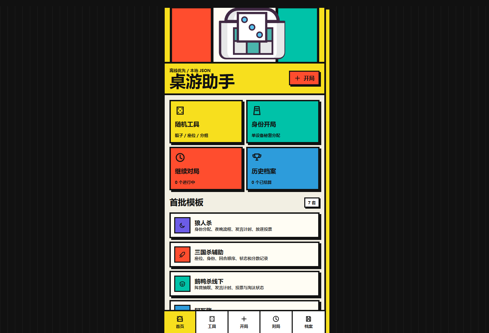

# Board Game Helper

[English](./README.en.md) | [中文](./README.cn.md)

> PWA and Android-ready tabletop assistant for scoring, rounds, random tools, templates, and local sessions.

    

## Showcase



## Why Star / Fork

- Clear, runnable project scope instead of a placeholder repository.
- Screenshot-first README so visitors understand the product in seconds.
- Small enough to study, fork, and customize for your own workflow.
- Bilingual documentation for both global and Chinese-speaking developers.

## Quick Start

```bash
npm install
npm run dev
```

## Documentation

- English guide: [README.en.md](./README.en.md)
- 中文说明：[README.cn.md](./README.cn.md)

If this project helps you, starring and forking it makes the work easier for others to discover.
