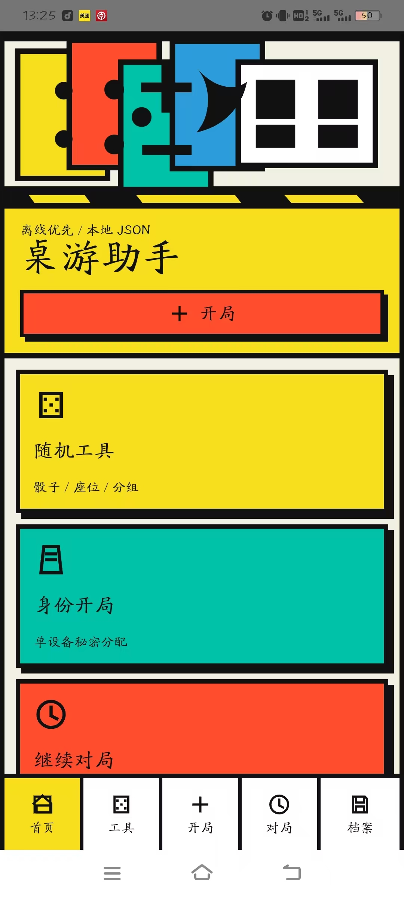

# Board Game Helper

[English](./README.en.md) | [中文](./README.cn.md)

> Local-first board game companion for scoring, rounds, random tools, templates, and session tracking.


## Preview



## Why It Feels Useful

- Designed for actual game nights instead of a generic app shell.
- Clear screenshot-led presentation makes the workflow easy to understand fast.
- Keeps local-first behavior for sessions, presets, and notes.
- Small enough to remix into a personal tabletop helper.

## What It Covers

- Scoring and round management
- Random tools for setup and play
- Templates and local session support
- PWA-friendly usage with room for Android packaging

## Quick Start

```bash
npm install
npm run dev
```

## Project Map

- `docs/` for screenshots and supporting notes
- `README.md` for the landing page
- `README.en.md` for English documentation
- `README.cn.md` for Chinese documentation

## More Docs

- English guide: [README.en.md](./README.en.md)
- 中文说明: [README.cn.md](./README.cn.md)

If this project helps you, starring or forking it makes it easier for others to discover it.
